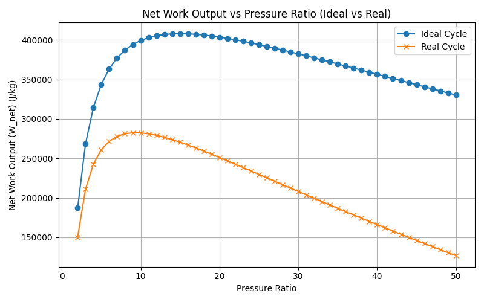
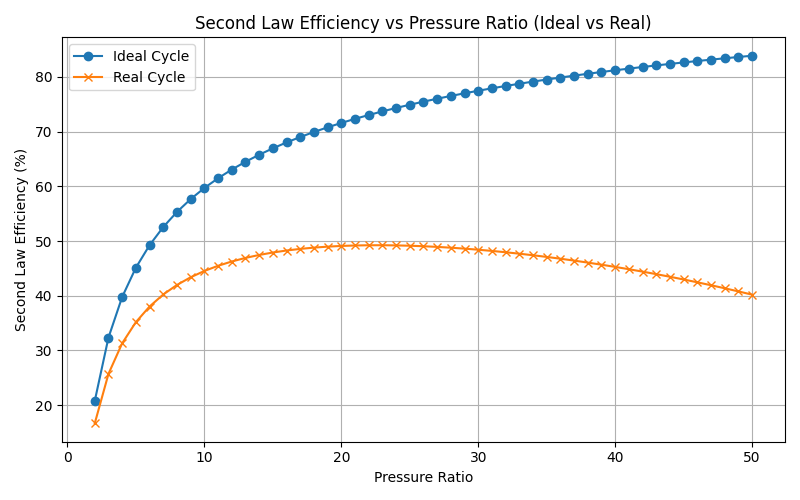

# Brayton-Cycle-Turbine-Simulator

Python-based thermodynamic performance model of an ideal and real Brayton cycle gas turbine.The simulator evaluates compressor, combustor, and turbine behaviour under realistic inefficiencies, performs parametric pressure ratio studies, and quantifies both energy and exergy performance using NumPy, Pandas, and Matplotlib.

## Overview

The tool bridges textbook thermodynamics with practical gas turbine design trade-offs.

## Engineering Context

The Brayton cycle forms the thermodynamic foundation of:

- Aircraft gas turbine engines
- Industrial power generation turbines
- Mechanical drive gas turbines

While ideal cycle analysis provides theoretical limits, real engines are governed by:

- Compressor and turbine inefficiencies
- Pressure losses in combustion
- Irreversibilities that reduce available work

This model was developed to move beyond ideal assumptions and quantify how these effects influence performance and optimal design points.

## Cycle Description

The Brayton cycle consists of four stages:

- **Isentropic Compression**
- Air is compressed, increasing pressure and temperature.
- **Constant Pressure Heat Addition**
- Fuel combustion raises the working fluid temperature to the turbine inlet temperature (TIT).
- **Isentropic Expansion**
- Hot gas expands through the turbine, producing shaft work.
- **Constant Pressure Heat Rejection**
- Exhaust returns to ambient pressure.

## Governing Equations

Ideal Compressor Outlet Temperature

T₂ = T₁ · PR^((γ − 1)/γ)

Ideal Turbine Exit Temperature

T₄ = T₃ · PR^(-(γ − 1)/γ)

Thermal Efficiency

η_th = (W_t − W_c) / Q_in

= (W_t − W_c) / \[C_p (T₃ − T₂)]

For the ideal cycle, thermal efficiency depends only on pressure ratio and is independent of turbine inlet temperature.

## Real Cycle Modelling

The real cycle incorporates:

- Compressor isentropic efficiency (η_c)
- Turbine isentropic efficiency (η_t)
- Combustor pressure loss (default 5%)
- Mass flow rate scaling
- Ambient reference temperature for exergy analysis
- Actual temperature relations:

T₂,actual = T₁ + (T₂s − T₁) / η_c

T₄,actual = T₃ − (T₃ − T₄s) · η_t

These modifications introduce realistic irreversibilities into the model.

## Exergy (Second Law) Analysis

To quantify irreversibilities, entropy generation is calculated:

Ṡ_gen = C_p ln(T₂/T₁) − R ln(P₂/P₁)

Exergy destruction is evaluated using the Gouy–Stodola theorem:

Eẋ_destroyed = T₀ · Ṡ_gen

Second-law (exergy) efficiency is defined as:

η_II = W_net / \[Q_in (1 − T₀ / T₃)]

This provides a deeper measure of performance than thermal efficiency alone.

## Parametric Study

Pressure ratio is swept across a configurable range.
For each pressure ratio, the model calculates:

- Compressor and turbine work
- Net work and net power
- Thermal efficiency
- Entropy generation
- Component-level exergy destruction
- Second-law efficiency

The simulation automatically identifies:

- Pressure ratio for maximum net power
- Pressure ratio for maximum thermal efficiency
- Pressure ratio for maximum second-law efficiency

Results are exported as structured CSV files for further analysis.

## Key Observations

From the current configuration:

- Real-cycle optimal pressure ratio is significantly lower than ideal predictions.
- Compressor irreversibility increasingly dominates at high pressure ratios.
- Thermal efficiency and second-law efficiency do not necessarily peak at the same operating point.
- Increasing turbine inlet temperature improves real-cycle efficiency but does not affect ideal-cycle efficiency.

These behaviours align with practical gas turbine design trends.

## Project Structure

├── config.py # Input parameters and operating conditions

├── brayton.py # Ideal and real cycle thermodynamic models

├── sensitivity.py # Parametric pressure ratio and TIT sweeps

├── plots.py # Graph generation and saving

├── main.py # Runs full simulation pipeline

├── Results/ # CSV performance outputs

└── Graphs/ # Saved performance plots

## Installation

Requirements:

- Python 3.8+
- NumPy
- Pandas
- Matplotlib

pip install -r requirements.txt

## Usage

Run the full simulation from the project root:
python main.py

The script performs a full parametric sweep, generates performance plots, and exports structured CSV outputs for post-processing.
Graphs are saved to the Graphs/ folder.
CSV outputs are saved to the Results/ folder.
All operating conditions and assumptions can be modified in config.py.

## Configuration Parameters

Parameter Default Description
| Parameter | Value | Description |
|----------------|-------------|------------------------------------|
| T1 | 298.15 K | Compressor inlet temperature |
| P1 | 100,000 Pa | Ambient pressure |
| TIT | 1400 K | Turbine inlet temperature |
| γ | 1.4 | Specific heat ratio (air) |
| Cp | 1005 J/kg·K | Specific heat at constant pressure |
| η_c | 0.85 | Compressor isentropic efficiency |
| η_t | 0.90 | Turbine isentropic efficiency |
| ṁ | 10 kg/s | Mass flow rate |
| Combustor loss | 5% | Pressure loss across combustor |

## Technical Scope

This project demonstrates:

- Applied thermodynamic modelling
- First and second law integration
- Sensitivity analysis
- Component-level irreversibility quantification
- Structured modular engineering code

It represents a simplified but structured gas turbine conceptual performance tool suitable for early-stage design studies.

## Results

